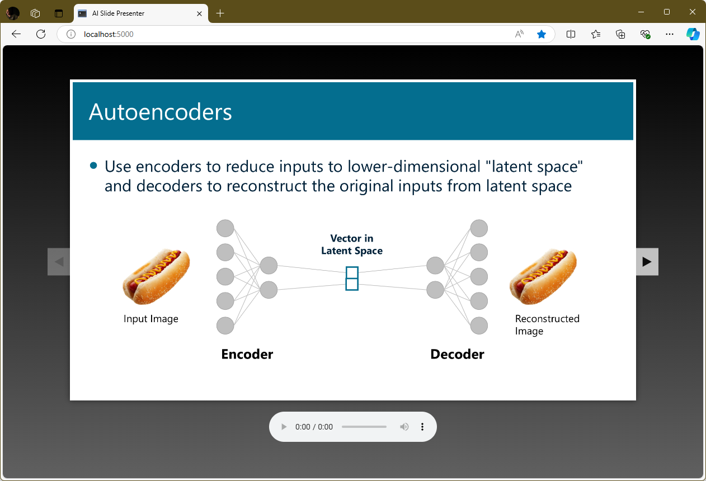

# Hands-on lab: Multimodal LLMs (MLLMs)

Traditional LLMs only deal with text. They take text as input and generate text as output. Multimodals LLMs, or MLLMs, can do more. OpenAI's `GPT-4o` models and Anthropic's `Claude` models accept images as well as text. Google's `Gemini` models accept text, images, audio, and video. MLLMs expand the boundaries of what LLMs can do by freeing them from the constraints of what can be expressed with text. With an MLLM, for example, you can use AI to describe what's in a photo, write code to implement a flow chart, or analyze a CRT scan.

In this lab, you'll build a Web app that uses AI to narrate PowerPoint slides. The app will input slide images to `GPT-4o` and prompt it to generate textual narrations. Then it will input the text to OpenAI's [TTS](https://platform.openai.com/docs/guides/text-to-speech/overview) model to convert text to speech. Finally, the app will play the MP3 files that `TTS` generates using an HTML5 audio element. The resulting app presents slides better than many experienced speakers do. In fact, you might be surprised by just how *well* an AI-driven presenter performs.



<a name="Exercise1"></a>
## Exercise 1: Prepare your environment and deploy the Web site

A basic Web site that uses the popular [Flask](https://flask.palletsprojects.com/en/2.3.x/) Web programming framework has been provided for you as a foundation to build on. In this exercise, you'll prepare your environment and get the Web site up and running.

1. Install the following Python packages in your environment if they aren't installed already:

	- [openai](https://pypi.org/project/openai/) for calling OpenAI APIs
	- [Flask](https://pypi.org/project/Flask/) for building Web sites

1. If you don't already have an OpenAI account and an API key to go with it, go to https://platform.openai.com/signup and create an account. Then go to the [API Keys](https://platform.openai.com/account/api-keys) page, generate an API key, and save it where you can easily retrieve it later.

	> Once generated, an OpenAI API key can't be retrieved by returning to the OpenAI Web site. Be sure to save it in a secure place so you can retrieve it when needed. If you lose an API key, your only recourse is to generate a new one.

1. Create a project directory in the location of your choice. Then copy all of the files and subdirectories in the "Flask" directory included with this lab to the project directory.

1. Take a moment to examine the files that you copied into the project directory. These files comprise a Web site written in Python and Flask. They include:

	- **app.py**, which holds the Python code that drives the site
	- **templates/index.html**, which contains the site's home page
	- **static/main.css**, which contains the CSS used to stylize the home page
	- **static/script.js**, which contains the JavaScript code used by the home page

	**index.html** is the page that's displayed when a user navigates to the site. The logic behind the page lives in **app.py** and **script.js**. The "static" directory also contains a subdirectory named "slides" that holds PowerPoint slide images.

1. Open a Command Prompt or terminal window and `cd` to the project directory. If you're running Windows, run the following command to create an environment variable named `FLASK_ENV` that tells Flask to run in development mode:

	```bash
	set FLASK_ENV=development
	```

	If you're running Linux or macOS, use this command instead:

	```bash
	export FLASK_ENV=development
	```

	Running Flask in development mode is helpful when you're developing a Web site because Flask automatically reloads any files that change while the site is running. If you let Flask default to production mode and change the contents of an HTML file or another asset, you have to restart Flask to see the change in your browser.

1. Now use the following command to start Flask:

	```bash
	flask run --debug
	```

1. Open a browser and go to http://localhost:5000/. Confirm that the Web site appears in your browser. Use the left and right arrows to browse the slides in the "static/slides" directory.

There's an HTML5 audio element under the slide images. It doesn't work yet because there's no audio to play. Let's fix that with AI.

<a name="Exercise2"></a>
## Exercise 2: Add logic to generate slide narrations

In this exercise, you'll modify the app you deployed in [Exercise 1](#Exercise1) to support audio slide narrations. This will require new code on the server to input slide images to `GPT-4o` and pass the resulting text to `TTS`. It will also require new code on the client to fetch the URL of an MP3 file each time the user navigates to another slide.

1. Create a file named **helpers.py** in the project directory. Open it in your favorite code editor and add the following `import`s to the top of the file:

	```python
	import os, base64
	from openai import OpenAI
	```

1. Add the following functions to **helpers.py**:

	```python
	def generate_narration(image_url):
	    file_extension = os.path.splitext(image_url)[1].lower()
		
	    if file_extension in ['.png', '.jpg', '.jpeg']:
	        mime_type = f'image/{file_extension[1:]}'
	    else:
	        return 'Unsupported image type'

	    base64_image = encode_image(image_url)
	    image_url = f'data:image/{mime_type};base64,{base64_image}'
		
	    prompt = f'''
	        Generate notes for this slide. Don't use bullet points.
	        Generate notes in a conversational style that a presenter
	        could read to present the slide to an audience.
	        '''

	    messages = [{
	        'role': 'user',
	        'content': [
	            { 'type': 'text', 'text': f'{prompt}' },
	            { 'type': 'image_url', 'image_url': { 'url': f'{image_url}' }}
	        ]
	    }]

	    client = OpenAI()

	    response = client.chat.completions.create(
	        model='gpt-4o',
	        messages=messages
	    )

	    return response.choices[0].message.content

	def encode_image(image_url):
	    with open(image_url, 'rb') as image_file:
	        encoded_string = base64.b64encode(image_file.read()).decode('utf-8')
	    return encoded_string
	```

	The `generate_narration` function submits a slide image to `GPT-4o` and prompts it to generate text from the slide. `encode_image` is a helper function that `generate_narration` calls to base-64-encode the slide image so it can be input to `GPT-4o` in the form of a data URL.

1. Add another helper function to **helpers.py**:

	```python
	def generate_audio(text, audio_url):
	    client = OpenAI()

	    response = client.audio.speech.create(
	        model='tts-1',
	        voice='fable',
	        input=text
	    )

	    with open(audio_url, 'wb') as audio_file:
	        audio_file.write(response.content)

	    return audio_url
	```

	The `generate_audio` function uses `TTS` to convert text to speech. The output is an MP3 file at the specified URL. The `tts-1` model favors speed of generation over quality of output. If you're not satisifed with the audio quality and are OK waiting slightly longer for MP3 files to be generated, try changing `tts-1` to `tts-1-hd`.

1. Save your changes to **helpers.py**.

1. Open **app.py** and add the following `import` at the top of the file to import the functions in **helpers.py**:

	```python
	from helpers import *
	```

1. Replace the `get_slide` function with the following implementation:

	```python
	@app.route('/get_slide/<int:index>')
	def get_slide(index):
	    if index >= 0 and index < len(images):
	        image_name = images[index]
	        image_url = f'{IMAGE_DIR}/{image_name}'

	        root, _ = os.path.splitext(image_name)
	        audio_name = root + '.mp3'
	        audio_url = f'{AUDIO_DIR}/{audio_name}'

	        if not os.path.exists(audio_url):
	            audio_url = ''

	        return jsonify({
	            'image_url': image_url,
	            'audio_url': audio_url    
	        })

	    return jsonify({
	        'image_url': '',
	        'audio_url': ''
	    })
	```

	The new version returns not only the URL of an image in the "static/slides" directory, but also the URL of an MP3 file in the "static/audio" directory if that MP3 file exists.

1. Add the following function to **app.py**:

	```python
	@app.route('/get_audio/<int:index>')
	def get_audio(index):
	    if index >= 0 and index < len(images):
	        image_name = images[index]
	        root, _ = os.path.splitext(image_name)
	        audio_name = root + '.mp3'
	        audio_url = f'{AUDIO_DIR}/{audio_name}'

	        # Return the URL if the audio file exists
	        if os.path.exists(audio_url):
	            return jsonify({'audio_url': audio_url})

	        # Use GPT-4o to generate a narration for the image
	        image_url = f'{IMAGE_DIR}/{image_name}'
	        text = generate_narration(image_url)

	        # Use TTS to generate audio
	        generate_audio(text, audio_url)
				
	        # Return the audio URL
	        return jsonify({'audio_url': audio_url})
		
	    return jsonify({'audio_url': ''})
	```

	The `get_audio` function returns the URL of an MP3 file containing a slide narration. If the file exists, the URL is returned immediately. If the file doesn't exist, the slide image is input to `GPT-4o` to generate narrative text, and then the text is input to OpenAI's `TTS` model to convert text to speech and create an MP3 file.

1. Save your changes to **app.py**. Then open **script.js** in the "static" folder and add the following function, which calls the server's `get_audio` endpoint to fetch the URL of an MP3 file containing a narration for the specified slide:

	```javascript
	async function getAudio(index) {
	    var response = await fetch(`/get_audio/${index}`);
	    var data = await response.json();
	    return data.audio_url;
	}
	```

1. Find the `loadContent` function at the bottom of **scripts.js**. Add the following `else` block to the `if (data.audio_url.length > 0)` block at the end of the function:

	```javascript
    else {
        // Otherwise generate audio for the slide
        overlay.style.display = "block";
        audio_url = await getAudio(index);
        audio.src = audio_url;
        overlay.style.display = "none";
    }
	```

	With his addition, the client will call back to the server and wait for it to generate an MP3 file if the call to `get_slide` doesn't return an audio URL.

Finish up by saving your changes to **script.js**. The app should now offer AI-generated slide narrations. Let's see how well it does on the sample slides included with this lab.

<a name="Exercise3"></a>
## Exercise 3: Test your changes

Can a multimodal LLM narrate a slide as well as a professional presenter who's a subject matter expert? Even if the slide contains diagrams or code or is deeply technical? There's one way to find out.

1. Return to the Command Prompt or terminal that's open to the project directory. Use the following command to make your OpenAI API key available through an environment variable if you're running Windows:

	```bash
	set OPENAI_API_KEY=key
	```

	Or use this command for Linux or macOS:

	```bash
	export OPENAI_API_KEY=key
	```

	In either case, replace *key* with your OpenAI API key.

1. Use a `flask run --debug` command to start the app again. Point your browser to http://localhost:5000/. Confirm that a spinner appears and then disappears. The spinner means the app is waiting for the server to generate an MP3 file with a slide narration. It only appears one time for each slide because the MP3 files are cached on the server and reused when the user revisits a slide.

1. Click the Play button in the HTML5 audio player under the slide. Does the narrator do a decent job of presenting the slide?

1. Click the right arrow to navigate to the next slide. Wait for the narration to be generated, and then play it. Once more, how well does it fit the content? Does the narrator adequately explain the code in the slide?

1. Navigate back to the first slide and jot down the first couple of sentences of the narration.

1. Flip to slide 2. Then delete **slide-1.mp3** from the "static/slides" directory and return to the first slide. A new narration will be generated. Is the narration identical to the one before? Why or why not?

If you want to try it with your own slides, simply delete the MP3 files in the "static/audio" folder and replace the images in "static/slides" with ones of your own. In PowerPoint, you can save an entire slide deck as a series of images by using the **Save As...** command and selecting **.jpg** or **.png** as the output type. Slides are shown in alphabetical order, so make sure the file names reflect the order in which you want the slides presented.