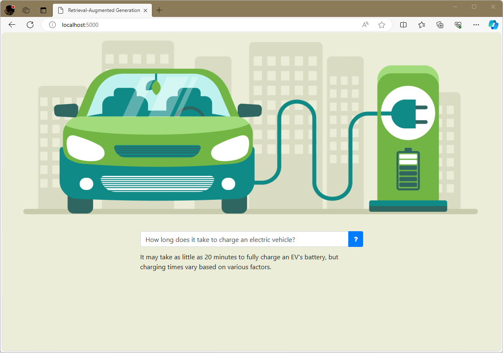

# Hands-on lab: Retrieval-Augmented Generation

The #1 use case for Large Language Models (LLMs) today is putting them over internal documents to make information in those documents easily discoverable. [Retrieval-augmented generation](https://arxiv.org/abs/2312.10997) (RAG) is a technique that allows LLMs to work with any number of documents of any size. LLMs limit how much text can be input to them in a single call. RAG involves dividing documents into "chunks" of (typically) a few hundred words each and generating an embedding vector for each chunk. To answer a question, you generate an embedding vector from the question, identify the *n* most similar embedding vectors, and provide the corresponding chunks of text to the LLM. Let's demonstrate by building a Web site that answers questions about electric vehicles (EVs) using a set of curated documents: three PDFs downloaded from government Web sites.



<a name="Exercise1"></a>
## Exercise 1: Build a vector store

A vector store, or [vector database](https://en.wikipedia.org/wiki/Vector_database), is a key component of a RAG system. It stores chunks of text extracted from documents, embedding vectors generated from the text, and optional metadata. Moreover, you can pass an embedding vector in a query and retrieve the *n* most similar embedding vectors along with the text and metadata associated with them.

There are many vector databases available. [ChromaDB](https://www.trychroma.com/) is a free and open-source vector database that's fast, scales to millions of vectors, and is easily accessed from Python and JavaScript. In this exercise, you will create a ChromaDB database and seed it with chunks of content from three PDF files.

1. Install the following Python packages in your environment if they aren't installed already:

	- [openai](https://pypi.org/project/openai/) for calling OpenAI APIs
	- [chromadb](https://pypi.org/project/chromadb/) for working with ChromaDB databases
	- [PyPDF](https://pypi.org/project/pypdf/) for extracting text from PDF files
	- [Flask](https://pypi.org/project/Flask/) for building Web sites

1. Install [SQLite3](https://www.sqlite.org/download.html) on your computer if it isn't installed already. Chroma requires SQLite3 version 3.35 or higher.

	> The SQLite Web site is light on details for installing SQLite3. A better explanation can be found [here](https://www.tutorialspoint.com/sqlite/sqlite_installation.htm). If you're installing on 64-bit Windows, download the `win64` zip files rather than the `win32` zip files.

1. If you don't already have an OpenAI account and an API key to go with it, go to https://platform.openai.com/signup and create an account. Then go to the [API Keys](https://platform.openai.com/account/api-keys) page, generate an API key, and save it where you can easily retrieve it later.

1. The resources that accompany this lab include a directory named "Documents" that contains three PDF files with information about electric vehicles. Navigate to that directory and create a text file named **create_database.py**.

1. Open **create_database.py** in your favorite code editor and paste in the following code:

	```python
	import chromadb, uuid
	from pypdf import PdfReader
	from chromadb.utils.embedding_functions import OpenAIEmbeddingFunction

	# Create a persistent ChromaDB database in the "chroma" subdirectory
	client = chromadb.PersistentClient('chroma')
	collection = client.create_collection(name='Electric_Vehicles')

	# Extract text from the PDFs and add them to the database
	file_names = [
	    'electric_vehicles.pdf',
	    'pev_consumer_handbook.pdf',
	    'department-for-transport-ev-guide.pdf'
	]

	for file in file_names:
	    print(f'Processing {file}')
	    reader = PdfReader(file)

	    for i, page in enumerate(reader.pages):
	        text = page.extract_text()

	        collection.add(
	            documents=[text],
	            metadatas=[{ 'file': file, 'page': i }],
	            ids=[uuid.uuid4().hex]
	        )
	```

	This Python script create a ChromaDB database in the "chroma" subdirectory, creates a collection named "Electric_Vehicles" in the database, and inserts chunks of text extracted from the PDF files into the collection. (A collection in ChromaDB is analagous to a table in a relational database.) Each chunk comprises one page of content. ChromaDB uses a built-in embeddings model to generate embedding vectors. That model is [`all-MiniLM-L6-v2`](https://huggingface.co/sentence-transformers/all-MiniLM-L6-v2), which generates vectors of 384 floating-point numbers for each text sample passed into it. You can configure it to use other embeddings models if you'd like, including OpenAI's `text-embedding-3-small` model. But `all-MiniLM-L6-v2` is sufficient for this lab, and best of all, it's free.
	
1. Run **create_database.py**. Once it's finished, confirm that the "Documents" directory contains a subdirectory named "chroma." The files in that directory and its subdirectories comprise your vector data store.

Now that the vector store is ready, the next step is to put it to work using Retrieval-Augmented Generation.

<a name="Exercise2"></a>
## Exercise 2: Build a Web site that uses the vector store

In this exercise, you'll build a Web site that answers questions about electric vehicles. The assets for the Web site are provided for you. You'll modify those assets to fetch chunks from the vector store and pass them to an LLM to use as context for answering questions.

1. Create a project directory in the location of your choice. Then copy all of the files and subdirectories in the "Flask" directory included with this lab to the project directory.

1. Take a moment to examine the files that you copied into the project directory. These files comprise a Web site written in Python and Flask. They include:

	- **app.py**, which holds the Python code that drives the site
	- **templates/index.html**, which contains the site's home page
	- **static/main.css**, which contains CSS to dress up the home page
	- **static/banner.jpg**, which contains the Web site's banner
	- **static/script.js**, which contains the JavaScript code used by the home page

	**index.html** is the page that's displayed when a user navigates to the site. The logic behind the page lives in **app.py** and **script.js**.

1. Open a Command Prompt or terminal window and `cd` to the project directory. If you're running Windows, run the following command to create an environment variable named `FLASK_ENV` that tells Flask to run in development mode:

	```bash
	set FLASK_ENV=development
	```

	If you're running Linux or macOS, use this command instead:

	```bash
	export FLASK_ENV=development
	```

	Running Flask in development mode is helpful when you're developing a Web site because Flask automatically reloads any files that change while the site is running. If you let Flask default to production mode and change the contents of an HTML file or another asset, you have to restart Flask to see the change in your browser.

1. Now use the following command to start Flask:

	```bash
	flask run --debug
	```

1. Open a browser and go to http://localhost:5000/. Confirm that the Web site appears in your browser:

	

1. Type a question into the text box in the center of the page. Then click the **?** button and confirm that "I don't know" appears underneath. At this point, the app doesn't attempt to answer the question you entered, but that will change momentarily.

1. Close your browser. Return to the Command Prompt or terminal window and stop Flask. Then use the following command to make your OpenAI API key available through an environment variable if you're running Windows:

	```bash
	set OPENAI_API_KEY=key
	```

	Or use this command for Linux or macOS:

	```bash
	export OPENAI_API_KEY=key
	```

	In either case, replace *key* with your OpenAI API key.

1. Copy the "chroma" directory that you created in the previous exercise to the project directory. This will make the vector database available to your Web site.

1. Open **app.py** in your favorite code editor. Find the comment that reads "TODO: Load the vector database." Paste the following code into **app.py** after the comment:

	```python
	client = chromadb.PersistentClient('chroma')
	collection = client.get_collection(name='Electric_Vehicles')
	```

	This code loads the database from the files in the "chroma" directory and retrieves a reference to the "Electric_Vehicles" collection.

1. Replace the `answer_question` function at the bottom of **app.py** with the following implementation:

	```python
	@app.route('/answer', methods=['GET'])
	def answer_question():
	    question = request.args.get('query')

	    if question is not None and len(question) > 0:
	        # Query the vector store
	        results = collection.query(
	            query_texts=[question],
	            n_results=3
	        )
			
	        # Concatenate the results to form context
	        context = ''
	        documents = results['documents'][0]

	        for document in documents:
	            context += document
	            context += '\n\n'
			
	        # Submit the question and the context to an LLM
	        client = OpenAI()
			
	        content = f'''
	            Answer the following question using the provided context, and if the
	            answer is not contained within the context, say "I don't know." Explain
	            your answer if possible.
				
	            Question:
	            {question}

	            Context:
	            {context}
	            '''
			
	        messages = [{ 'role': 'user', 'content': content }]

	        # Get the response
	        result = client.chat.completions.create(
	            model='gpt-4o',
	            messages=messages
	        )

	        return result.choices[0].message.content
	```

	This function uses OpenAI's flagship `GPT-4o` model to answer a question using context retrieved from a vector store.

1. Save your changes to **app.py**. Then return to the Command Prompt or terminal window and use a `flask run --debug` command to start the application again. Point your browser to http://localhost:5000/ and type a question such as "How far can an EV go on a single charge?" into the text box. Confirm that an answer appears underneath.

1. Test the app by submitting additional questions. Here are some questions to try:

	- Does regenerative braking cause brakes to wear out faster?
	- How long does it take to charge an electric vehicle?
	- What are three good reasons to buy an electric vehicle?
	- Are EVs cheaper to maintain than conventional cars?
	- Will my EV explode if I take it through a car wash?

Finally, submit the question "Why is the sky blue?" and confirm that the answer is "I don't know." Left unbounded, an LLM would answer this question by drawing from the data it was trained with. Using RAG to put an LLM over a set of documents and instructing the LLM to answer "I don't know" if it can't answer the question from the context provided is an effective way to limit an LLM's propensity to hallucinate.

<a name="Exercise3"></a>
## Exercise 3: Add support for streaming output

Currently, answers to questions don't appear until an entire answer has been generated and returned to the browser. You can make the site feel more interactive by taking advantage of streaming output, which returns "chunks" of text as they're generated a few words at a time. In this exercise, you'll modify **app.py** and **script.js** to support streaming output and deliver a better user experience.

1. Find the following lines at the bottom of **app.py**:

	```python
	result = client.chat.completions.create(
	    model='gpt-4o',
	    messages=messages
	)

	return result.choices[0].message.content
	```

	Replace them with these lines:

	```python
	chunks = client.chat.completions.create(
	    model='gpt-4o',
	    messages=messages,
	    stream=True
	)

	return Response(stream_with_context(generate(chunks)))
    ```

1. Now add the following function to **app.py**:

	```python
	def generate(chunks):
	    for chunk in chunks:
	        content = chunk.choices[0].delta.content
	        if content is not None:
	            yield content
	```

	Rather than wait for a response and return the generated content all at once, the modified code uses a local `generate` function in combination with Flask's [`stream_with_context`](https://flask.palletsprojects.com/en/2.3.x/patterns/streaming/) function to keep the request context open and return one chunk of content at a time.

1. Open **script.js** in the "static" folder and find the following statements:

	```python
	// Submit the question
	var response = await fetch('/answer?query=' + query);

	// Show the response
	answer.append((await response.text()).replaceAll("\n", "<br />"));
	```

	Replace them with these statements:

	```python
	// Submit the question
	var response = await fetch('/answer?query=' + query);
	var reader = response.body.getReader();
	var decoder = new TextDecoder("utf-8");

	// Display the streaming response
	while (true) {
	    var { done, value } = await reader.read();
	    if (done) break;
	    var chunk = decoder.decode(value, { stream: true });
	    answer.append(chunk.replaceAll("\n", "<br />"));
	}
	```

	The modified code uses `getReader` to retrieve a readable stream from the response and [`read`](https://developer.mozilla.org/en-US/docs/Web/API/ReadableStreamDefaultReader/read) to read chunks of content from the stream. Reading continues until the `done` value returned by `read` indicates that there is no more content.

1. Save all of your code changes. Refresh the page in your browser or start it again. Submit a few questions and confirm that responses appear a few words at a time rather than all at once.

Streaming output doesn't make the Web site any faster, but it makes it *feel* faster to those who use it. It delivers the same typewriter-like text-generation experience as the ChatGPT Web site, and it requires little effort to implement.