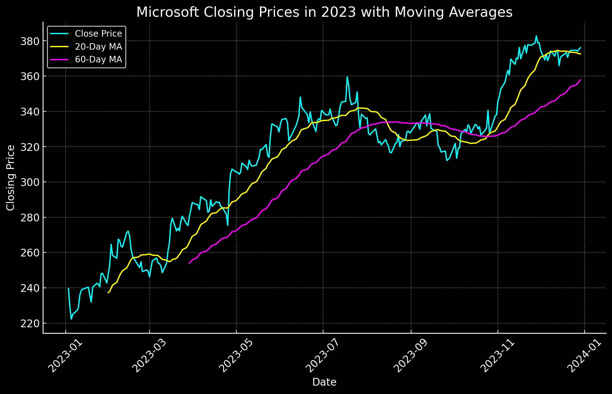

# Hands-on lab: The OpenAI Assistants API

OpenAI's [Assistants API](https://platform.openai.com/docs/assistants/overview) simplifies the process of creating virtual assistants that can interact intelligently with users and call external APIs to perform tasks that LLMs can't. For example, they can use calendar APIs to find free space in your schedule, flight APIs to determine whether a flight is going to arrive on time, and weather APIs to find out whether it's going to rain while you're on vacation. They can also retrieve data from documents and databases, and thanks to the `code interpreter` tool, they can manipulate that data in various ways and even produce charts and graphs from it.

In this lab, you'll modify the Ask LISA demo to use a database of stock prices rather than the Northwind database. You'll also modify LISA so that she becomes an expert in analyzing stocks. Moreover, you'll see first-hand the power that `code interpreter` brings to the table.


<a name="Exercise1"></a>
## Exercise 1: Add voice input to Ask LISA

The first step is to get Ask LISA up and running on your PC. While you're at it, you'll add a microphone button to the UI that lets you voice questions for LISA rather than type them in.

1. Install the following Python packages in your environment if they aren't installed already:

	- [openai](https://pypi.org/project/openai/) for calling OpenAI APIs
	- [Flask](https://pypi.org/project/Flask/) for building Web sites

1. Install [SQLite3](https://www.sqlite.org/download.html) on your computer if it isn't installed already.

	> The SQLite Web site is light on details for installing SQLite3. A better explanation can be found [here](https://www.tutorialspoint.com/sqlite/sqlite_installation.htm). If you're installing on 64-bit Windows, download the `win64` zip files rather than the `win32` zip files.

1. If you don't already have an OpenAI account and an API key to go with it, go to https://platform.openai.com/signup and create an account. Then go to the [API Keys](https://platform.openai.com/account/api-keys) page, generate an API key, and save it where you can easily retrieve it later.

	> Once generated, an OpenAI API key can't be retrieved by returning to the OpenAI Web site. Be sure to save it in a secure place so you can retrieve it when needed. If you lose an API key, your only recourse is to generate a new one.

1. Create a project directory in the location of your choice. Then copy all of the files and subdirectories in the "Flask" directory included with this lab to the project directory.

1. Open a Command Prompt or terminal window and `cd` to the project directory. If you're running Windows, run the following commands to create an environment variable named `FLASK_ENV` that tells Flask to run in development mode and an environment variable named `OPENAI_API_KEY` containing your OpenAI API key:

	```bash
	set FLASK_ENV=development
	set OPENAI_API_KEY=key
	```

	If you're running Linux or macOS, use this command instead:

	```bash
	export FLASK_ENV=development
	export OPENAI_API_KEY=key
	```

	In either case, replace *key* with your OpenAI API key.

1. Now use the following command to start Flask:

	```bash
	flask run --debug
	```

1. Open a browser and go to http://localhost:5000/. Confirm that the Ask LISA Web site appears in your browser.

1. Type "My name is ________. What's your name?" into the input field at the bottom of the page and press **Enter**. Confirm that the response is "My name is LISA" or something similar.

1. Open **index.html** in the project directory's "templates" subdirectory and add the following statement after the `<div class="typing-controls">` statement to add a microphone button to the row of buttons at the bottom of the page:

	```python
	<span id="mic-btn" class="material-symbols-rounded">mic</span>
	```

1. Open **script.js** in the "static" subdirectory and add the following statement after the `const deleteButton = document.querySelector("#delete-btn")` statement near the top of the file:

	```python
	const micButton = document.querySelector("#mic-btn");
	```

1. Add the following statements before the `init()` statement at the bottom of the file:

	```python
	async function typewriter(text, el, delay=5) {
	    for (let i = 0; i < text.length; i++) {
	        await new Promise(resolve => setTimeout(resolve, delay));
	        el.value += text[i];
	        el.style.height =  `${initialInputHeight}px`;
	        el.style.height = `${el.scrollHeight}px`;
	    }
	}

	micButton.addEventListener("click", () => {
	    chatInput.value = ''; // Clear any existing text
	    window.SpeechRecognition = window.SpeechRecognition || window.webkitSpeechRecognition;
	    const recognition = new SpeechRecognition();
	    recognition.interimResults = false;

	    recognition.addEventListener("result", async (e) => {
	        // Get the spoken input as a text string
	        var query = Array.from(e.results)
	            .map(result => result[0])
	            .map(result => result.transcript)
	            .join('')

	        // Insert the text into the input control
	        await typewriter(query, chatInput);

	        // Pass the question to the server
	        handleOutgoingChat();
	    });

	    recognition.start();
	});
	```

	The code you added uses HTML5's [Web Speech API](https://developer.mozilla.org/en-US/docs/Web/API/Web_Speech_API) to get input from the default microphone, convert speech to text, and submit the text to the Assistants API just as if it had been typed into the input field at the bottom of the page. The `typewriter` functions adds a nice visual effect by inserting the text into the input field one character at a time rather than all at once.

1. Save your changes to these files. Return to the browser where Ask LISA is running and refresh the page. Click the microphone button to the right of the input field and say "How many employees does Northwind have?" Confirm that the answer is 9.

	> If the browser asks for your permission to use the microphone, answer yes. If you grant permission and your speech isn't converted to text, go into your browser settings and confirm that the microphone you wish to use is the default microphone.

With this foundation in place, it's time to give LISA a makeover and transform her from a Northwind expert to a stocks expert.

<a name="Exercise2"></a>
## Exercise 2: Modify the assistant and the database that it uses

The goal of this exercise is to replace the Northwind database that LISA is currently using with a database of stock prices and transform LISA into an intelligent assistant for analyzing stocks. The database is provided for you in a file named **nasdaq.db**. It holds daily stock prices (open, low, high, and close) and trading volumes for 100 of the most valuable companies listed on the NASDAQ stock exchange from January 1, 2020 through August 9, 2024.

1. Copy **nasdaq.db** from the resources that accompany this lab to the  project directory's "data" subdirectory.

1. Open **app.py** and replace the block of code that creates or retrieves an assistant with this:

	```python
	assistant = get_or_create_assistant(
	    client,
	    'LISA-stocks',
	    instructions='''
	        You are a friendly assistant named LISA who can answer questions about stock prices and
	        can illustrate your answers by generating charts and graphs. When asked about stock prices,
	        use daily closing prices unless directed to do otherwise. Assume that monetary amounts
	        are in dollars. Round such amounts to the nearest dollar in your output, and use commas
	        as separators for amounts greater than $999. Use a black background with light text and
	        graphics for any charts you produce. Do not return any markdown in your text responses.
	        ''',
	    tools=[database_tool, { 'type': 'code_interpreter' }]
	)
	```

	The modified code updates the instructions passed to the assistant to let her know that she'll be fielding questions about stocks.

1. Open **helpers.py** and replace the `database_tool` definition with the one below.

	```python
	database_tool = {
	    'type': 'function',
	    'function': {
	        'name': 'query_database',
	        'description': '''
	            Queries the NASDAQ database to answer a question or respond
	            to a command. The database contains information about selected
	            NASDAQ stocks from January 1, 2020 through August 9, 2024. It
	            contains a table named Stocks that has the following schema:

	            CREATE TABLE Stocks (
	                ID INTEGER PRIMARY KEY AUTOINCREMENT,
	                Symbol TEXT NOT NULL,   -- Stock symbol (for example, "MSFT")
	                Date DATE NOT NULL,     -- Date
	                Open NUMERIC NOT NULL,  -- Opening price of the stock on that date
	                Low NUMERIC NOT NULL,   -- Lowest price of the stock on that date
	                High NUMERIC NOT NULL,  -- Highest price of the stock on that date
	                Close NUMERIC NOT NULL, -- Closing price of the stock on that date
	                Volume INT NOT NULL     -- Number of shares traded on that date
	            )
	            ''',
	        'parameters': {
	            'type': 'object',
	            'properties': {
	                'input': {
	                    'type': 'string',
	                    'description': 'Input from the user'
	                },
	            },
	            'required': ['input']
	        }
	    }
	}
	```

	The modified tool replaces information about the Northwind database with information about the NASDAQ database so the Assistants API can determine when it needs to call our `query_database` function to generate a SQL query, execute it against the database, and return the query results.

1. Find the prompt used to generate SQL queries from user input in the `text2sql` function and replace it with this:

	```python
	prompt = f'''
	    Generate a well-formed SQLite query from the prompt below. Return
	    the SQL only. Do not include a description or markdown characters.

	    PROMPT: {text}

	    The database has a table named Stocks that is defined as follows:

	    CREATE TABLE Stocks (
	        ID INTEGER PRIMARY KEY AUTOINCREMENT,
	        Symbol TEXT NOT NULL,   -- Stock symbol (for example, "MSFT")
	        Date DATE NOT NULL,     -- Date
	        Open NUMERIC NOT NULL,  -- Opening price of the stock on that date
	        Low NUMERIC NOT NULL,   -- Lowest price of the stock on that date
	        High NUMERIC NOT NULL,  -- Highest price of the stock on that date
	        Close NUMERIC NOT NULL, -- Closing price of the stock on that date
	        Volume INT NOT NULL     -- Number of shares traded on that date
	    )
	    '''
	```

	The modified prompt gives the LLM used to convert user input into SQL queries the schema information it needs. In this case, the schema is extraordinarily simple because the database contains just one table.

1. Find the statement in the `execute_sql` function at the bottom of the file that connects to **northwind.db** and modify it to connect to **nasdaq.db** instead:

	```python
	connection = sqlite3.connect('data/nasdaq.db')
	```

Now any queries that the LLM generates will execute against NASDAQ database rather than Northwind. And thanks to the updated prompt, the LLM has the information it needs to generate syntactically correct queries.

<a name="Exercise3"></a>
## Exercise 3: Test the modified assistant

Let's see what the new and improved LISA is capable of by issuing a series of instructions. You may find that you have to "coach" LISA a bit to get the results you want, especially when generating charts and graphs. If she doesn't deliver what you asked for the first time, tell her how to correct it. She will usually comply, and the more specific you are with your instructions, the more likely she is to get it right. When given vague instructions, she might come back and ask you for more information, but she's more likely to make assumptions that don't necessarily comport with what you had in mind.

1. Return to http://localhost:5000/ in your browser and refresh the page. Then pose the following question and confirm that the answer is $383:

	```
	What was Microsoft's highest closing price in 2023?
	```

1. Next, ask LISA to create a visualization for you:

	```
	Plot closing prices for each day.
	```

	Confirm that a chart similar to the one below appears. If the chart doesn't have a black background, ask LISA to redo it with a black background. The instructions passed to the assistant ask her to use black backgrounds and light text, but she doesn't always comply. The good news is that she generally *will* comply when asked to modify a previously generated chart. You can even ask her to use a larger or smaller font or generate a bar chart rather than a line chart.

	

1. Now give `code interpreter` a more challenging task with the following command:

	```
	Add 20-day and 60-day moving averages to the chart.
	```

	Confirm that the resulting chart is similar to the one below.

	

	What role did `code interpreter` play in this response? After prompting the app to query the database to retrieve the data needed via a call to `query_database`, the Assistants API used `code interpeter` first to generate code to compute the 20- and 60-day moving averages, and then to add the results to the graph. Moving averages are common computations and `code interpreter` knew how to write code to compute them without additional input or prompting. It works not just with moving averages but with other financial metrics such as [Moving Average Convergence/Divergence](https://www.investopedia.com/terms/m/macd.asp) (MACD) and [Bollinger bands](https://www.investopedia.com/terms/b/bollingerbands.asp).

1. Dates where moving-average curves intersect or "cross over" are sometimes used by traders as signals to buy or sell. Find out if LISA can determine where such crossovers occurred:

	```
	On what dates did the moving averages cross over?
	```

1. Assuming LISA answered correctly, pose this question:

	```
	If I had purchased 100 shares of MSFT each time the moving averages crossed and sold them one week later, would I have made money or lost money? How much?
	```

Feel free to prompt LISA with instructions of your own to see what she's capable of. You can even ask her for an opinion on stocks and stock purchases, but take anything she says with a grain of salt. An LLM is a next-token predictor backed by a massive statistical language model, and any output that it generates should be treated with that in mind.