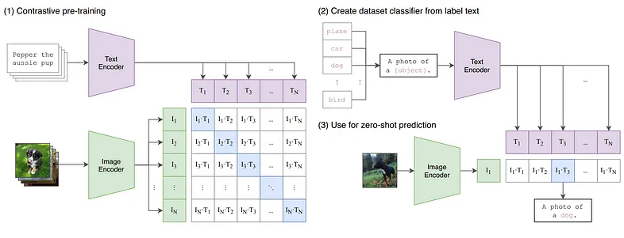
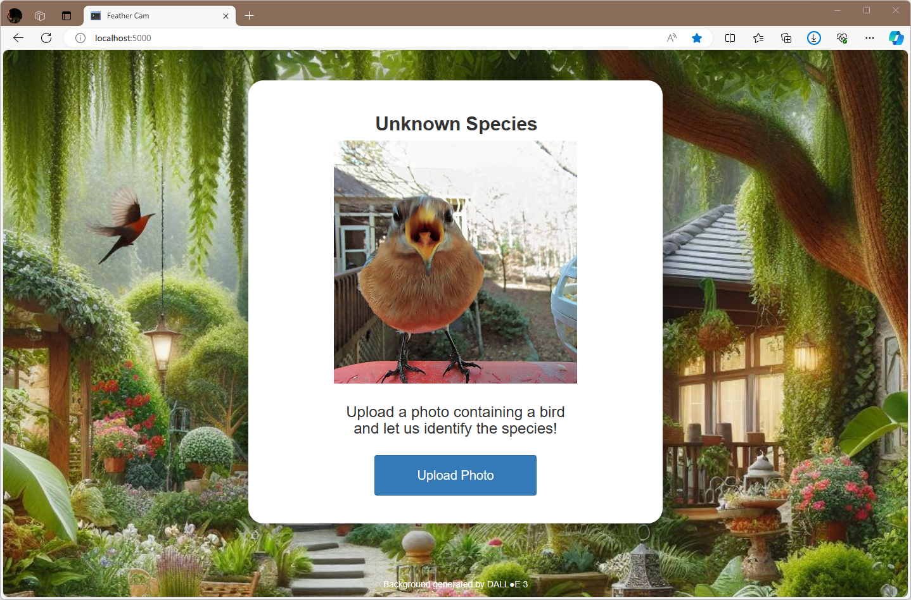
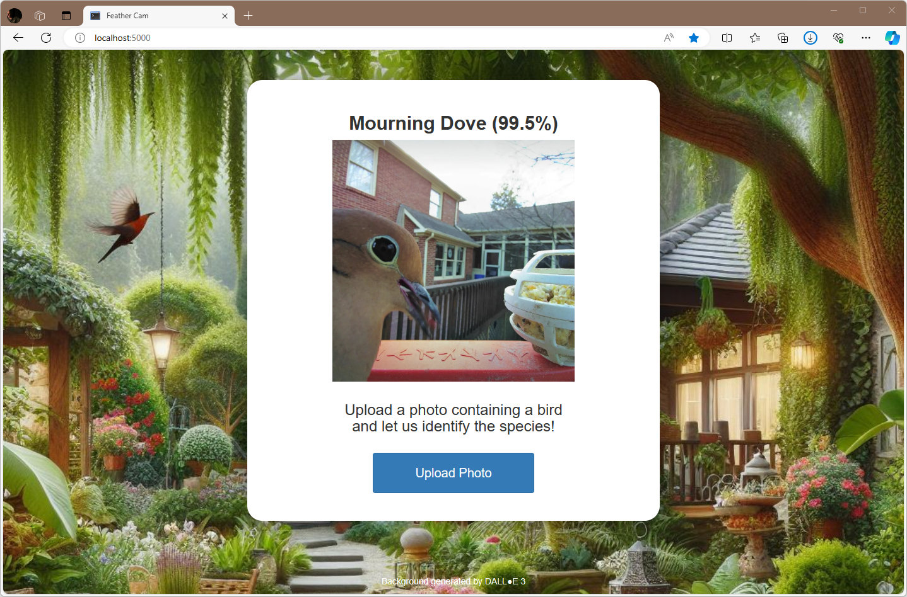

# Hands-on lab: Zero-shot image classification

Training a CNN to classify images is a time-consuming proposition. Even with transfer learning to help out, you still have to collect images representing each class, choose a base model, and train a classifier on features extracted by the base model. What if someone told you that state-of-the-art image classification can be accomplished without training a model or collecting even a single training image? Furthermore, what if images classified this way aren't constrained to the 1,000 ImageNet classes, but can be classified in hundreds of thousands of ways?

That's zero-shot image classification in a nutshell. It relies on [Contrastive Language-Image Pretraining](https://openai.com/research/clip) (CLIP) models, which are trained to correlate images and textual descriptions of the same images. OpenAI developed CLIP and open-sourced it after training it for 30 days on almost 600 high-end V100 GPUs with approximately 400 million text-image pairs. Pretrained CLIP implementations are available from [Hugging Face](https://huggingface.co/) and from other sources.



Intelligent bird feeders such as [Bird Buddy](https://mybirdbuddy.com/) and [Birdfy](https://www.birdfy.com/) that use AI to identify birds are popular these days. (One of my friends got one for Christmas and has been spamming social media with bird pics ever since!) Let's use CLIP to write the software for an AI bird feeder. With zero-shot image classification, most of the work is already done.

<a name="Exercise1"></a>
## Exercise 1: Spin up a Web site

In this exercise, you will deploy a local Web site that accepts photo uploads. The files that you need, including the Python file that contains all the logic, are provided for you. In the next exercise, you'll modify that file to add functionality to the site.

1. The site uses the popular [Flask](https://pypi.org/project/Flask/) Web application framework as well as [Pillow](https://pypi.org/project/pillow/), a fork of the Python Imaging Library (PIL). If these packages aren't installed in your Python environment, take a moment to install them now.

1. Create a project directory in the location of your choice. Then copy all of the files and subdirectories in the "Flask" directory included with this lab to the project directory.

1. Take a moment to examine the files that you copied into the project directory. They include:

	- **app.py**, which holds the Python code that drives the site
	- **templates/index.html**, which contains the site's home page
	- **static/main.css**, which contains CSS to dress up the home page
	- **static/background.png**, which contains the home page's background

	The background image was generated by OpenAI's DALL●E 3 from the prompt "Lush back yard with birds and bird feeders."

1. Open a Command Prompt or terminal window and `cd` to the project directory. If you're running Windows, run the following command to create an environment variable named `FLASK_ENV` that tells Flask to run in development mode:

	```bash
	set FLASK_ENV=development
	```

	If you're running Linux or macOS, use this command instead:

	```bash
	export FLASK_ENV=development
	```

	Running Flask in development mode is helpful when you're developing a Web site because Flask automatically reloads any files that change while the site is running. If you let Flask default to production mode and change the contents of an HTML file or another asset, you have to restart Flask to see the change in your browser.

1. Now use the following command to start Flask:

	```bash
	flask run --debug
	```

1. Open a browser and navigate to http://localhost:5000/. Confirm that the Web site appears in your browser.

1. Click the **Upload Photo** button and select one of the bird photos in the "Birds" directory included with this lab. Confirm that the photo appears on the page and "Unknown Species" appears above the photo.

	

The species is unknown because the Web site currently lacks code to classify the photo. Let's use zero-shot image classification to fix that.

<a name="Exercise2"></a>
## Exercise 2: Modify the site to use zero-shot image classification

Hugging Face makes several pretrained CLIP models available for download. The model you'll use is [`clip-vit-large-patch14`](https://huggingface.co/openai/clip-vit-large-patch14), which was trained by OpenAI on 400 million text-image pairs harvested from the Internet. It combines a [vision transformer](https://en.wikipedia.org/wiki/Vision_transformer) (ViT) that produces an embedding from an image with a text transformer that decodes the embedding into a caption such as "a photo of a parrot." Other CLIP models such as [`CLIP-ViT-B-32-laion2B-s34B-b79K`](https://huggingface.co/laion/CLIP-ViT-B-32-laion2B-s34B-b79K) were trained on billions of text-image pairs. These models and many others are available in Hugging Face's [transformers](https://pypi.org/project/transformers/) package.

1. If the transformers package isn't installed in your Python environment, install it now. Either PyTorch or TensorFlow must be installed first, so if neither of these is installed in your environment, install one or both of them before installing the transformers package. For more information, see https://huggingface.co/docs/transformers/en/installation.

1. Open **app.py** in your favorite code editor. Add the following `import` at the top of the file:

	```python
	from transformers import pipeline
	```

1. Find the comment that reads "TODO: Instantiate the CLIP model." On the next line, paste in the following code:

	```python
	model = pipeline(
	    model='openai/clip-vit-large-patch14',
	    task='zero-shot-image-classification'
	)
	```

	This statement instantiates `clip-vit-large-patch14` and downloads the model weights if they haven't been downloaded already. The first time you instantiate the model, you'll experience a slight delay while the weights are downloaded.

1. Find the comment that reads "TODO: Define candidate labels." Paste the following code into **app.py** after the comment:

	```python
	class_labels = [
	    'Robin', 'Cardinal', 'Blue Jay', 'Bluebird', 'Mourning Dove',
	    'Crow', 'Starling', 'Mockingbird', 'Magpie', 'Junco',
	    'Chickadee', 'Nuthatch', 'Titmouse', 'Sparrow', 'Finch',
	    'Goldfinch', 'Wren', 'Woodpecker', 'Hummingbird', 'Parrot',
	    'Eagle', 'Hawk', 'Heron', 'Buzzard', 'Warbler'
	]
	```

	These are the classes that the model will use to classify images input to it. With zero-shot image classification, adding additional classes is as simple as adding class names to the list.

1. Find the comment that reads "Function that uses zero-shot image classification to classify a bird image." Replace the `identify_species` function after the comment with the following implementation:

	```python
	def identify_species(image):
	    result = model(image, candidate_labels=class_labels)
	    predicted_class = result[0]['label']
	    score = result[0]['score']
	    return f'{predicted_class} ({score:.1%})'
	```

	This version uses `clip-vit-large-patch14` to classify images using the candidate classes you defined earlier. The results returned by the model are sorted in descending order with the most likely candidate appearing first — that is, in the zeroth element.

1. Save your changes to **app.py**. Then return to the browser in which the Web site is running and refresh the page. (if you closed it, simply open a new browser instance and navigate to http://localhost:5000/ again.) Upload one of the bird photos in the "Birds" folder and confirm that the species appears above the photo.

	

	The number in parentheses is a confidence score. 99.5% means the model is 99.5% certain it classified the photo correctly.

1. Test the app by uploading additional photos. Feel to upload photos of your own or even to use photos downloaded from the Internet. If you upload a photo containing a species the model doesn't recognize, try adding the species to the `class_labels` list in **app.py**. Unless it's a rare bird species, there's a very good chance that the model will recognize it.

1. Suppose you don't care for birds but you love dogs. How much effort would it take to modify the app to recognize dog breeds rather than bird species?

Zero-shot image classification doesn't mean you'll never need a CNN. When training involves teaching a model to differentiate between audio spectrograms or recognize faces, for example, transfer learning is still your best option. But when it comes to classifying images containing everyday objects, zero-shot learning makes short work of building image classifiers.